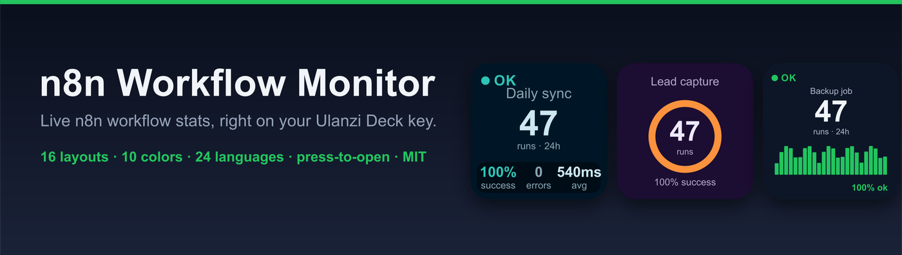
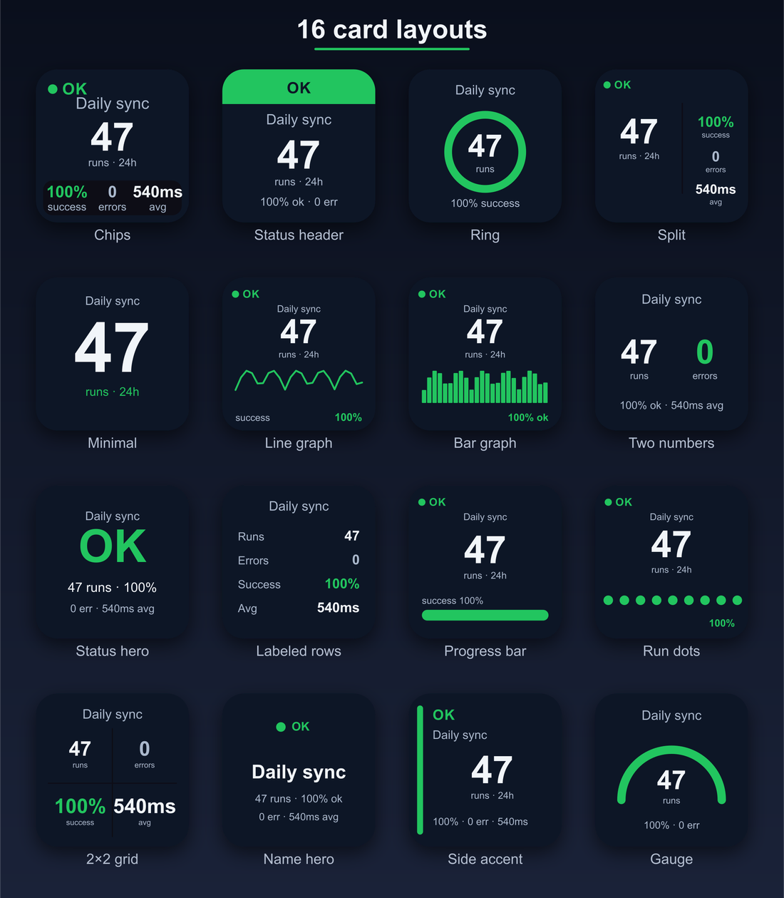
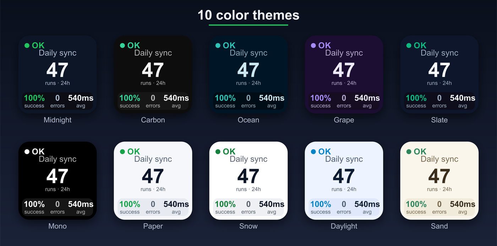
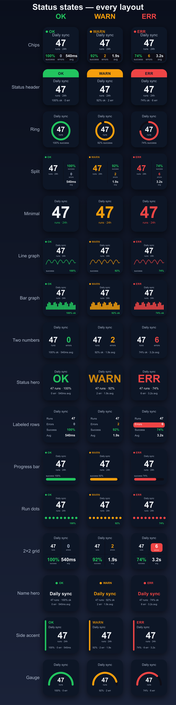

# n8n Workflow Monitor — Ulanzi Deck Plugin

**Turn any key on your Ulanzi Deck into a live status light for an n8n workflow.**
Runs, errors, success rate and average duration — at a glance, updating on its own, in the style and color you choose.

---

## Table of contents

- [What it does](#what-it-does)
- [Features](#features)
- [Layout gallery](#layout-gallery)
- [The status system](#the-status-system-) — green / amber / red, thresholds, blinking
- [Requirements](#requirements)
- [Installation](#installation)
- [First-time setup](#first-time-setup)
- [Settings reference](#settings-reference) — **every option explained**
- [The 16 layouts](#the-16-layouts)
- [Metrics & periods](#metrics--periods)
- [Long workflow names](#long-workflow-names)
- [Desktop notifications](#desktop-notifications)
- [Press to open](#press-to-open)
- [A deck full of monitors (performance)](#a-deck-full-of-monitors-performance)
- [Languages](#languages)
- [Privacy & security](#privacy--security)
- [Troubleshooting](#troubleshooting)
- [Credits & license](#credits--license)

---

## What it does

If you run automations in [n8n](https://n8n.io), you usually only find out a workflow broke *after* something downstream goes wrong. This plugin puts that information where you can't miss it — on a physical key in front of you.

Assign the **Workflow Monitor** action to any key, point it at one workflow, and the key becomes a tiny always-on dashboard:

- it polls the n8n API on an interval you choose,
- counts **runs, errors, success rate and average duration** over a time window,
- renders them on the key in one of **16 layouts** and **10 color themes**,
- turns **green → amber → red** as things degrade, and **blinks red** when a workflow is genuinely failing,
- can fire a **desktop notification** the moment a workflow goes down (and again when it recovers),
- and **opens the workflow** (or its run history) in your browser when you press the key.

No cloud middle-man, no telemetry — the plugin talks **directly** to your own n8n instance, and your API key never leaves the machine.

---

## Features

| | |
|---|---|
| 📊 **Live metrics** | Runs, errors, success %, average duration — over 1h / 24h / 7d / 30d |
| 🎨 **16 layouts** | Chips, gauge, ring, bar graph, progress, 2×2 grid, status hero, and more |
| 🌈 **10 color themes** | Midnight, slate, ocean, forest, grape, ember, rose, mono… |
| 🚦 **Traffic-light status** | Green OK → amber WARN → red ERR, driven by your own thresholds |
| 🔴 **Blink on failure** | The whole key flashes red when errors hit the critical threshold |
| 🔔 **Desktop alerts** | Opt-in system notification on failure and on recovery |
| 🖱️ **Press to open** | Jump straight to the workflow editor or its execution history |
| 🔤 **Two text sizes** | Independent sliders for the workflow name and the card text |
| 📝 **Long-name modes** | Clip, auto-fit, paginate, or scroll long workflow names |
| 🌍 **24 languages** | Fully localized settings panel, with right-to-left support |
| 🔒 **Private by design** | Talks directly to your n8n, no telemetry, key stored locally |
| ⚡ **Scales to a full deck** | Fair-share rendering keeps every key responsive |

---

## Layout gallery

**16 layouts** — pick the one that reads best for you:

**10 color themes** — same card, your palette:

---

## The status system 🚦

This is the heart of the plugin. Every key is a **traffic light** with three states, and *you* decide where the lines are.

| State | When | What you see |
|-------|------|--------------|
| 🟢 **OK** | No problems | Green accent, calm card |
| 🟡 **WARN** | Errors reached your **Warn** threshold, **or** the last run was slower than your **Slow** limit | Amber accent, gentle pulse |
| 🔴 **ERR** | Errors reached your **Critical** threshold | Red accent — **the entire key blinks red** |

Two numbers in the settings drive this:

- **Warn at errors ≥** — e.g. `1` → a single error nudges the key to amber.
- **Critical at errors ≥** — e.g. `5` → five or more errors turn it red and start the blink.

Plus **Slow if last run > (ms)** raises a warning when a workflow still *succeeds* but is taking too long.

> 💡 The status isn't just a corner dot — **every layout colors its main visual** by status (the bars, the gauge arc, the ring, the big number…), and error counts are highlighted, so a glance across a full deck instantly shows what needs attention.

---

## Requirements

- **Ulanzi Deck** hardware (built and tested on the **D200X**) with **Ulanzi Studio 2.1.0+**
- An **n8n** instance you can reach over HTTP/HTTPS, with the **public API enabled**
- macOS 10.11+ or Windows 10+

---

## Installation

1. **Download** this repository — [clone it](https://github.com/prostonik94/ulanzi-n8n-workflow-monitor) or grab the latest release ZIP.
2. **Copy the plugin folder** `com.n8n.workflowmonitor.ulanziPlugin` into your Ulanzi plugins directory:
   - **macOS:** `~/Library/Application Support/Ulanzi/UlanziDeck/Plugins/`
   - **Windows:** `%APPDATA%\Ulanzi\UlanziDeck\Plugins\`
3. **Restart Ulanzi Studio** (it loads plugins on startup).
4. In Studio, find **Workflow Monitor** in the action list and **drag it onto a key**.

That's it — no account, no marketplace, no build step. The plugin ships with everything it needs.

---

## First-time setup

Select the key, open its settings panel on the right, and fill in three things:

1. **Base URL** — your n8n address, e.g. `https://n8n.example.com`
2. **API Key** — in n8n: **Settings → n8n API → Create an API key**, then paste it here
3. **Workflow ID** — open the workflow in n8n and copy the ID from the URL: `…/workflow/`**`AbCd1234EfGh5678`**

Press **Save settings**. The key starts updating immediately. Everything else has sensible defaults you can tune later.

> 🔒 The API key is stored **locally**, inside the key's own settings on your machine. It is only ever sent to the n8n host you typed in — never anywhere else.

---

## Settings reference

Every control in the panel, explained.

### n8n Connection
| Setting | What it does |
|---|---|
| **Base URL** | Address of your n8n instance. Used both to read data and to open the workflow on press. |
| **API Key** | n8n API key (read-only use). Stored locally; sent only to your n8n host. |
| **Workflow ID** | The single workflow this key monitors (from the `/workflow/<ID>` URL). |
| **On key press, open** | What pressing the key opens in your browser: the **Workflow** editor, or its **Executions** (run history). |

### Thresholds
| Setting | What it does |
|---|---|
| **Warn at errors ≥** | Error count that flips the key to **amber (WARN)**. |
| **Critical at errors ≥** | Error count that flips the key to **red (ERR)** and starts the **blink**. |
| **Slow if last run > (ms)** | If the most recent run took longer than this, show WARN even with zero errors. |
| **Desktop alert on failure** | Opt-in. Sends a system notification when the workflow enters ERR, and again when it recovers. |

### Display
| Setting | What it does |
|---|---|
| **Big number** | Which metric is the hero figure: **Runs / Errors / Success (%) / Avg (duration)**. |
| **Period** | Time window for all stats: **1h / 24h / 7d / 30d**. |
| **Layout** | One of the **16 layouts** (see below). |
| **Card text size (1–10)** | Scales the secondary text (chips & labels). Higher = bigger; very high levels may crowd small layouts. |
| **Long name** | How an over-long workflow name is shown: **Left / Fit / Paginate / Scroll** (see below). |
| **Title size (1–10)** | Scales the **workflow name** independently of the card text. |
| **Check every (sec)** | Polling interval (minimum 5s). Lower = fresher, more API calls. |
| **Color** | One of **10 color themes**. |
| **Language** | Language of **this settings panel** (24 options). The card on the deck stays in English. |

---

## The 16 layouts

| Layout | Best for |
|---|---|
| **Chips** | The default — big number + success / errors / avg chips |
| **Header** | Title bar on top, metric below |
| **Ring** | Circular progress ring around the value |
| **Gauge** | Speedometer-style arc that recolors by status |
| **Split** | Two big numbers side by side |
| **Minimal** | Just the hero number, huge |
| **Line** | Compact single-line readout |
| **Bars** | Mini bar graph of recent activity |
| **Dual** | Runs vs errors, paired |
| **Status hero** | Giant OK / WARN / ERR word |
| **Rows** | Labeled rows (runs, errors, success…) with the error row highlighted |
| **Progress** | Horizontal progress bar that recolors by status |
| **Dots** | A row of run dots, green/red per outcome |
| **2×2 grid** | Four metrics in a grid, error cell highlighted red |
| **Name hero** | Workflow name front and center |
| **Sidebar** | Accent sidebar + stats |

All of them recolor their **main visual** by status, so the traffic-light read works in every style.

---

## Metrics & periods

- **Runs** — how many executions happened in the period.
- **Errors** — how many of those failed.
- **Success** — success rate as a percentage.
- **Avg** — average execution duration.

The **period** (1h / 24h / 7d / 30d) applies to all of them, so you can watch a workflow over the last hour or zoom out to a month.

---

## Long workflow names

Workflow names are often long. Pick how the card handles overflow:

- **Left** *(default)* — clip to the left, **static** (no animation, zero render cost).
- **Fit** — automatically shrink the name to fit the width.
- **Paginate** — page through the name in chunks.
- **Scroll** — classic marquee scroll.

> 💡 The default is intentionally **static** — it's the lightest option, which matters when a whole deck is full of monitors. Animated modes look great on a few keys; use them where they count.

---

## Desktop notifications

Turn on **Desktop alert on failure** and the plugin notifies you the moment a workflow's status *changes* — not on every check, only on the transition:

- 🔴 when it crosses into **ERR** — *"&lt;workflow&gt; is failing (N errors)"*
- 🟢 when it returns to **OK** — *"&lt;workflow&gt; recovered"*

**macOS:** uses the built-in notification system out of the box — **no setup required**. (The sender shows as "Script Editor"; that's a macOS quirk for script-driven notifications.) If you'd like a custom icon, install [`terminal-notifier`](https://github.com/julienXX/terminal-notifier) (`brew install terminal-notifier`) and the plugin will use it automatically.

**Windows:** native toast notifications via PowerShell.

---

## Press to open

Pressing the key opens, in your default browser, either:

- the **workflow editor** (`/workflow/<id>`), or
- its **executions** / run history (`/workflow/<id>/executions`),

depending on the **On key press, open** setting. Handy for jumping straight from "that key went red" to the actual run that failed.

---

## A deck full of monitors (performance)

You can fill an entire deck with monitors. To keep everything responsive, the plugin uses a **fair-share rendering budget**: the total update rate to the device is capped and split evenly across the keys that are currently animating, so no single key can hog the display pipeline.

In practice: keep most keys on the **Left** (static) name mode and animations stay snappy even with a packed deck. Reserve **Scroll/Paginate** for the few keys you want to draw the eye.

---

## Languages

The settings panel is available in **24 languages**, including full right-to-left support for Arabic, Hebrew and Persian:

🇬🇧 English · 🇷🇺 Русский · 🇪🇸 Español · 🇫🇷 Français · 🇩🇪 Deutsch · 🇮🇹 Italiano · 🇳🇱 Nederlands · 🇵🇱 Polski · 🇧🇷 Português (BR) · 🇵🇹 Português (PT) · 🇨🇳 简体中文 · 🇹🇼 繁體中文 · 🇯🇵 日本語 · 🇰🇷 한국어 · 🇹🇷 Türkçe · 🇺🇦 Українська · 🇮🇩 Bahasa Indonesia · 🇻🇳 Tiếng Việt · 🇨🇿 Čeština · 🇸🇪 Svenska · 🇸🇦 العربية · 🇮🇱 עברית · 🇮🇷 فارسی · 🇮🇳 हिन्दी

> The **deck card** itself stays in English (short labels like "OK", "errors", "avg") so it reads consistently on the hardware — only the configuration panel is translated.

---

## Privacy & security

- **No third-party servers.** The plugin calls your n8n REST API directly over HTTPS.
- **No telemetry.** Nothing is collected or sent anywhere.
- **Your key stays local.** The API key lives in the key's settings on your machine and is only sent to the n8n host you configured.
- **Read-only.** The plugin only *reads* execution data; it never modifies your workflows.

---

## Troubleshooting

**The key says "set workflow…"** — Base URL, API Key and Workflow ID aren't all filled in yet. Complete them and press Save.

**The key shows an error / no data** — Check that the Base URL is reachable, the API key is valid, and the workflow ID is correct. Make sure the **n8n public API is enabled** on your instance.

**Settings fields look empty when I reopen the panel** — The card keeps working from its saved values; the panel just doesn't always re-display them. Re-enter and Save if you change something.

**No desktop notification appeared** — Make sure **Desktop alert on failure** is on, and that **Focus / Do Not Disturb** isn't silencing notifications. The first notification after install can be swallowed while macOS registers the sender — it works from then on.

**I changed a setting and nothing happened** — Give it a second; layout/color/period apply instantly, but data refreshes on the next check (or press the key to refresh).

---

## Credits & license

**MIT licensed** — see [LICENSE](LICENSE).

This plugin is based on the excellent **[Uptime Monitor for Ulanzi Deck](https://github.com/JEAN-ALMEIDA-CZO/Ulanzi-Uptime-Monitor-Plugin)** by **Jean Almeida** (also MIT). Huge thanks to Jean for the original plugin architecture that made this possible.

Built on:
- the [Ulanzi Deck Plugin SDK](https://github.com/UlanziTechnology/UlanziDeckPlugin-SDK) (Apache-2.0)
- [`ws`](https://github.com/websockets/ws) (MIT)
- optionally [`terminal-notifier`](https://github.com/julienXX/terminal-notifier) (MIT) for branded macOS notifications

See [THIRD-PARTY-LICENSES.md](THIRD-PARTY-LICENSES.md) for full details.

---

**Made for the n8n & Ulanzi communities.** If this is useful, a ⭐ on the repo helps others find it.

